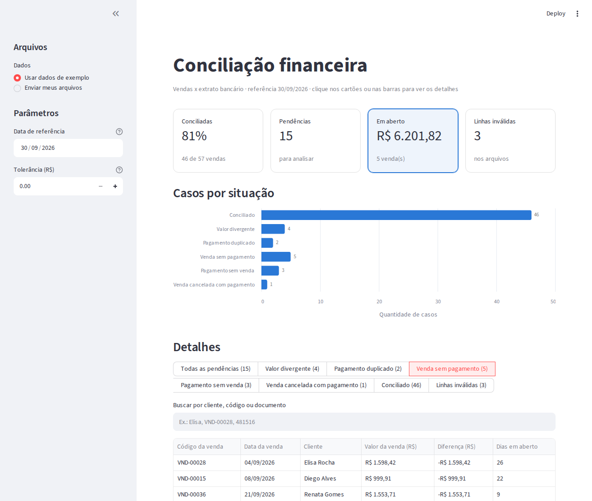
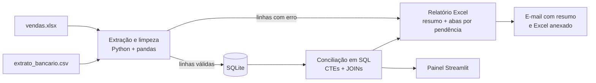
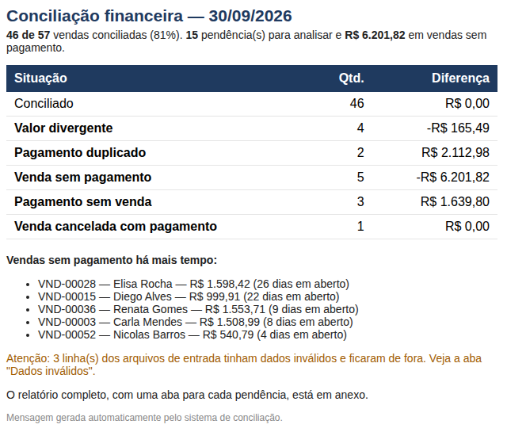

# Conciliação Financeira Automática (Python + SQL)

Automação que confere, sem trabalho manual, se cada venda de uma empresa foi realmente paga, cruzando a **planilha de vendas** com o **extrato bancário**. No fim, ela gera um **relatório em Excel**, envia um **resumo por e-mail** e oferece um **painel no navegador** com tudo o que precisa de atenção.



> Os dados de exemplo são **fictícios** e gerados pelo script `dados/gerar_dados.py`, com erros colocados de propósito para mostrar o que a conciliação encontra.

## O problema

No financeiro de muitas empresas, alguém abre a planilha de vendas e o extrato do banco lado a lado e confere linha por linha:
- essa venda foi paga?
- o valor que entrou bate com o valor da venda?
- entrou dinheiro que não corresponde a nenhuma venda?

É um trabalho repetitivo, demorado e fácil de errar. Este projeto faz essa conferência automaticamente.

## Como funciona



1. **Extração e limpeza** (`conciliacao/extracao.py`)
   Lê o Excel de vendas e o CSV do banco (separado por `;`, em latin-1, como exportam os bancos brasileiros). Converte valores como `"1.234,56"` e `"R$ 89,90"` e datas `dd/mm/aaaa`, padroniza nomes e encontra o código da venda (`VND-00000`) no histórico do extrato com expressão regular.
2. **Validação**
   Linhas com data inexistente, valor vazio ou ilegível, ou código repetido não entram na conciliação. Elas vão para uma aba própria do relatório, com o número da linha e o motivo.
3. **Carga no banco** (`conciliacao/banco.py`, `sql/schema.sql`)
   Os dados válidos são gravados num banco SQLite numa única transação. Os valores ficam em **centavos (inteiros)** para evitar erros de arredondamento.
4. **Conciliação em SQL** (`sql/conciliacao.sql`)
   Uma consulta com CTEs agrupa os pagamentos por venda e classifica cada caso:

   | Situação | Regra |
   |---|---|
   | Conciliado | pagamento único com o mesmo valor da venda |
   | Valor divergente | pago, mas com diferença acima da tolerância |
   | Pagamento duplicado | mais de um crédito para a mesma venda |
   | Venda sem pagamento | nenhum crédito encontrado (mostra há quantos dias está em aberto) |
   | Pagamento sem venda | crédito sem código ou com código que não existe |
   | Venda cancelada com pagamento | venda cancelada que mesmo assim recebeu dinheiro |

   Débitos (tarifas, pagamentos a fornecedores) são ignorados.
5. **Relatório** (`conciliacao/relatorio.py`)
   Excel com uma aba de **Resumo**, uma aba para cada tipo de pendência, a lista de conciliados e os dados inválidos, já formatado (moeda, datas, cabeçalho fixo).
6. **E-mail** (`conciliacao/notificacao.py`)
   Envia pelo Gmail um resumo em HTML (indicadores, tabela por situação e as vendas em aberto há mais tempo) com o Excel anexado.
7. **Painel** (`painel.py`)
   Página no navegador, feita com Streamlit. Os indicadores e as barras do gráfico são clicáveis e filtram a tabela de detalhes (ex.: "Ver vendas em aberto" lista as vendas sem pagamento, da mais antiga para a mais nova). Tem busca por cliente, código ou documento, download da lista filtrada em CSV e do relatório completo em Excel. Funciona com os dados de exemplo ou com arquivos enviados pelo usuário, sem instalar nada quando publicado no Streamlit Community Cloud.



## Resultado com os dados de exemplo

```
Vendas válidas: 60 | inválidas: 2
Lançamentos válidos: 60 | inválidos: 1
Resumo: Conciliado: 46 | Venda sem pagamento: 5 | Valor divergente: 4 |
        Pagamento sem venda: 3 | Pagamento duplicado: 2 | Venda cancelada com pagamento: 1
```

| Situação | Qtd. | Valor das vendas | Valor recebido | Diferença |
|---|---:|---:|---:|---:|
| Conciliado | 46 | R$ 55.459,88 | R$ 55.459,88 | R$ 0,00 |
| Valor divergente | 4 | R$ 4.336,13 | R$ 4.170,64 | -R$ 165,49 |
| Pagamento duplicado | 2 | R$ 2.112,98 | R$ 4.225,96 | R$ 2.112,98 |
| Venda sem pagamento | 5 | R$ 6.201,82 | R$ 0,00 | -R$ 6.201,82 |
| Pagamento sem venda | 3 | — | R$ 1.639,80 | R$ 1.639,80 |
| Venda cancelada com pagamento | 1 | R$ 590,58 | R$ 590,58 | R$ 0,00 |

## Como rodar

Requisitos: Python 3.10 ou mais novo.

```bash
git clone https://github.com/coqueiroz/conciliacao-financeira.git
cd conciliacao-financeira
python3 -m venv .venv && source .venv/bin/activate
pip install -r requirements.txt

python dados/gerar_dados.py                    # cria os arquivos de exemplo
python main.py --data-referencia 2026-09-30    # roda a conciliação
```

O relatório é salvo em `saida/conciliacao_2026-09-30.xlsx`, junto com o banco `conciliacao.db`, o log `execucao.log` e uma prévia do e-mail (`email_previa.html`).

**Modo demonstração x modo cliente**

O mesmo código roda de dois jeitos, escolhidos pela configuração `MODO` (em *Settings > Secrets* no Streamlit Cloud):

| `MODO` | Para quem | Como abre |
|---|---|---|
| `demonstracao` (padrão) | portfólio, recrutadores | com dados de exemplo de uma loja fictícia |
| `cliente` | uso real | sem exemplos: pede a planilha de vendas e o extrato, com modelos para baixar |

`NOME_CLIENTE` (opcional) coloca o nome da empresa no título do painel.

**Enviar por e-mail pelo painel (sem Terminal)**

Quem usa o sistema só digita o e-mail de destino no painel e clica em *Enviar resumo e relatório*. O remetente é configurado **uma única vez** por quem publica o sistema:

- **No Streamlit Cloud:** em *App > Settings > Secrets*, cole o conteúdo de `.streamlit/secrets.toml.exemplo` preenchido.
- **No computador:** copie `.streamlit/secrets.toml.exemplo` para `.streamlit/secrets.toml` e preencha.

Para evitar abuso na versão pública, o painel aceita no máximo 5 destinatários por envio e 3 envios por sessão. Outros provedores (como Outlook) funcionam definindo `SMTP_SERVIDOR` e `SMTP_PORTA`.

**Enviar por e-mail pela linha de comando** (útil para agendar a execução)

1. Crie uma *senha de app* no Gmail em [myaccount.google.com/apppasswords](https://myaccount.google.com/apppasswords) (é preciso ter a verificação em duas etapas ativada).
2. Copie `.env.exemplo` para `.env` e preencha o seu e-mail e a senha de app. O `.env` não vai para o GitHub.
3. Rode:

```bash
python main.py --data-referencia 2026-09-30 --enviar-email
python main.py --data-referencia 2026-09-30 --enviar-email --para financeiro@empresa.com
```

**Abrir o painel**

```bash
streamlit run painel.py
```

Opções:

| Parâmetro | Padrão | Para quê |
|---|---|---|
| `--vendas` | `dados/entrada/vendas.xlsx` | planilha de vendas |
| `--extrato` | `dados/entrada/extrato_bancario.csv` | extrato do banco |
| `--saida` | `saida/` | pasta do relatório, banco e log |
| `--data-referencia` | hoje | data usada para calcular os dias em aberto |
| `--tolerancia` | `0` | diferença aceita em reais (ex.: `0.05` ignora diferenças de até 5 centavos) |
| `--enviar-email` | desligado | envia o resumo e o Excel por e-mail |
| `--para` | `EMAIL_DESTINO` do `.env` | um ou mais destinatários |

## Testes

```bash
pytest
```

São 31 testes: conversão de valores e datas no formato brasileiro, leitura do código da venda no histórico, cada regra de conciliação (rodando o SQL num banco em memória) e o e-mail (com um servidor SMTP falso, sem enviar nada de verdade).

## Decisões técnicas

- **Valores em centavos**: somar `0.1 + 0.2` em ponto flutuante dá `0.30000000000000004`. Guardar inteiros evita diferenças fantasmas na conciliação.
- **Regra de negócio em SQL**: a lógica de conciliação fica num arquivo `.sql` legível, fácil de revisar e de levar para outro banco (PostgreSQL, SQL Server).
- **Dados ruins não travam o processo**: linhas inválidas são separadas e reportadas, e o resto segue normalmente.
- **Carga em transação**: se algo falhar no meio da carga, nada fica gravado pela metade.
- **Senha fora do código**: as credenciais do e-mail ficam num `.env` local, ignorado pelo Git.

## Estrutura

```
conciliacao-financeira/
├── main.py                  # linha de comando: roda tudo, gera relatório e envia e-mail
├── painel.py                # painel no navegador (Streamlit)
├── conciliacao/
│   ├── extracao.py          # leitura, limpeza e validação
│   ├── banco.py             # SQLite: criação, carga e consulta
│   ├── pipeline.py          # junta as etapas e calcula os indicadores
│   ├── relatorio.py         # relatório Excel
│   └── notificacao.py       # e-mail via Gmail
├── sql/
│   ├── schema.sql           # tabelas
│   └── conciliacao.sql      # regras de conciliação
├── dados/gerar_dados.py     # gera dados fictícios de exemplo
└── tests/                   # testes com pytest
```

## Próximos passos

- Ler o extrato direto no formato OFX, que os bancos também exportam.
- Conciliar vendas sem código no histórico por valor e data aproximados.
- Agendar a execução diária (cron ou n8n) para o e-mail chegar todo dia de manhã.

---
Feito por **Lucas Coqueiro** · [LinkedIn](https://www.linkedin.com/in/lucas-coqueiro2000) · [Outros projetos](https://github.com/coqueiroz)
